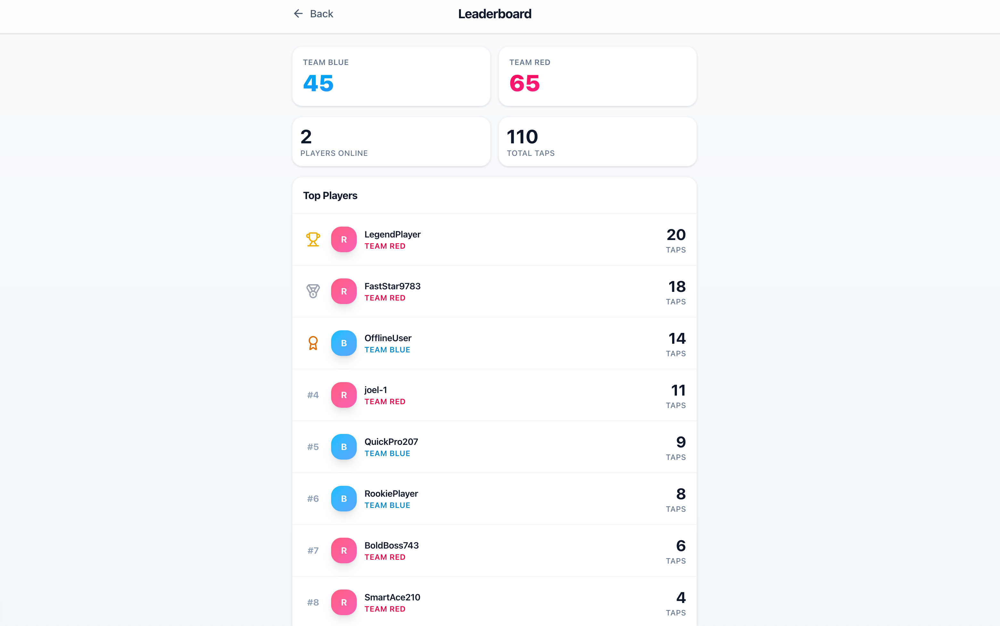

# Stream Wars - Real-time Tap Battle Game

A real-time multiplayer tap battle game built with Next.js, Kafka, and WebSockets. Players are automatically assigned to Team Blue or Team Red and compete by tapping to score points for their team.

## Features

- **Real-time multiplayer gameplay** with WebSocket connections
- **Kafka integration** for scalable event streaming
- **Mobile-first responsive design**
- **Live leaderboard** with top players
- **Instant score updates** across all connected players
- **Beautiful animations** with Framer Motion
- **Docker Compose** for easy local development

## Screenshots

Below are example screenshots from the game. If you add your own screenshots to the `docs/screenshots/` directory, they will be shown directly in this README:





You can rename the files and adjust the paths to match where you store your screenshots.

## Tech Stack

- **Frontend**: Next.js 16, React 19, TypeScript, Tailwind CSS
- **Backend**: Next.js API Routes, WebSocket Server
- **Message Queue**: Apache Kafka (KRaft mode) with KafkaJS
- **Real-time**: WebSocket connections
- **Styling**: Tailwind CSS with custom animations

## Quick Start

### Prerequisites

- Docker & Docker Compose
- Git

### Running the Application

To start the application, run:

```bash
docker-compose -f docker-compose.dev.yml up
```

This will:
- Start Kafka, Redis, and the application
- Install dependencies automatically
- Enable hot reload for development
- Make the application available at http://localhost:3000

### Using the Helper Script (Optional)

You can also use the helper script for convenience:

```bash
# Make script executable (first time only)
chmod +x scripts/dev.sh

# Start in background
./scripts/dev.sh up

# View logs
./scripts/dev.sh logs

# Stop everything
./scripts/dev.sh down
```

### Access the Game

- **Game**: http://localhost:3000
- **Leaderboard**: http://localhost:3000/leaderboard

## How It Works

### Game Flow

1. **User Joins**: Players are automatically assigned to Team Blue or Red (50/50 distribution)
2. **Tap Events**: Each tap sends a message to Kafka topic `game-taps`
3. **Kafka Consumer**: Processes tap events and updates game state
4. **WebSocket Broadcast**: Real-time updates sent to all connected players
5. **Live Leaderboard**: Top players displayed with team affiliations

### Architecture

```
┌─────────────┐    ┌─────────────┐    ┌─────────────┐
│   Frontend  │    │   Next.js   │    │   Kafka     │
│   (React)   │◄──►│   API + WS  │◄──►│ (KRaft)     │
└─────────────┘    └─────────────┘    └─────────────┘
                           │
                           ▼
                   ┌─────────────┐
                   │  Consumer   │
                   │   Service    │
                   └─────────────┘
```

### Key Components

- **TapButton**: Large, animated tap interface with team colors
- **ScoreDisplay**: Real-time progress bars and team scores
- **UserInfo**: Player stats and team assignment
- **Leaderboard**: Top players with rankings and team colors

## Development

### Project Structure

```
src/
├── app/                    # Next.js app router
│   ├── api/               # API routes
│   ├── leaderboard/       # Leaderboard page
│   └── page.tsx          # Main game page
├── components/            # React components
│   └── ScoreDisplay.tsx  # Team scores
├── lib/                  # Utilities and services
│   ├── kafka.ts         # Kafka configuration
│   ├── websocket-server.ts  # Standalone WebSocket server
│   ├── types.ts         # TypeScript types
│   └── utils.ts         # Helper functions
```

### Making Changes

Since the development environment uses volume mounting, any changes you make to the code will automatically reload:

1. Edit files in your local directory
2. Changes are automatically reflected in the running container
3. Next.js hot reload will update the UI

### Stopping the Application

Press `Ctrl+C` in the terminal, or run:

```bash
docker-compose -f docker-compose.dev.yml down
```

## Environment Variables

The application uses these environment variables (configured in `docker-compose.dev.yml`):

- `KAFKA_BROKERS`: Kafka broker address (default: `kafka:9092`)
- `REDIS_URL`: Redis connection URL (default: `redis://redis:6379`)
- `NEXT_PUBLIC_WS_URL`: WebSocket URL for client connections (default: `ws://localhost:3001`)
- `WS_PORT`: WebSocket server port (default: `3001`)

For local development, these are pre-configured and do not need to be changed.

## Troubleshooting

### Port Already in Use

If you get a port conflict error:

```bash
# Check what's using the port
lsof -i :3000
lsof -i :3001

# Stop the conflicting process or change ports in docker-compose.dev.yml
```

### Changes Not Reflecting

If your changes are not showing up:

```bash
# Restart the container
docker-compose -f docker-compose.dev.yml restart app
```

### Clean Start

If you encounter issues, try a clean start:

```bash
# Stop and remove containers and volumes
docker-compose -f docker-compose.dev.yml down -v

# Start fresh
docker-compose -f docker-compose.dev.yml up
```

## Kubernetes/OpenShift Deployment

Stream Wars can be deployed on Kubernetes or OpenShift with Strimzi Kafka and Redis in the same namespace.

### Prerequisites

- Kubernetes or OpenShift cluster
- Strimzi Kafka Operator installed
- Kafka cluster and Redis deployed in the same namespace

### Quick Deploy

1. **Build and push Docker image**:
   ```bash
   docker build -t your-registry/stream-wars:latest .
   docker push your-registry/stream-wars:latest
   ```

2. **Update configuration** in `k8s/configmap.yaml`:
   - Set your Kafka cluster name
   - Set your Redis service name
   - Set your public WebSocket URL

3. **Update deployment image** in `k8s/deployment.yaml`

4. **Deploy**:
   ```bash
   # Create Kafka user
   kubectl apply -f k8s/strimzi-kafka-user.yaml
   
   # Create secrets (see k8s/README.md for details)
   kubectl create secret generic stream-wars-secrets ...
   kubectl create secret generic kafka-client-certs ...
   
   # Deploy application
   kubectl apply -f k8s/
   ```

For a full deployment guide, see: [k8s/README.md](./k8s/README.md)

## Contributing

1. Fork the repository
2. Create a feature branch
3. Make your changes
4. Test with `docker-compose -f docker-compose.dev.yml up`
5. Submit a pull request

## License

MIT License - you are welcome to use this project for learning and development.
